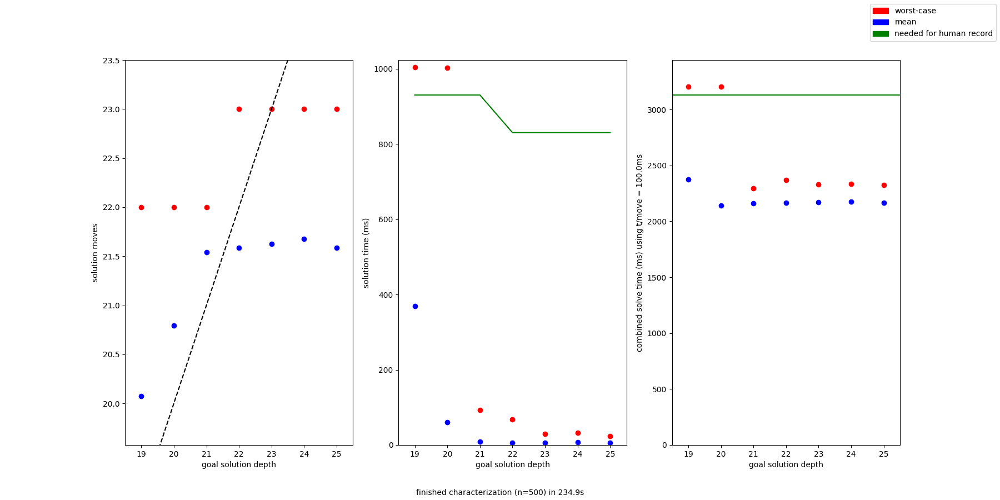

# kociemba-characterization

Proof-of-concept / requirement-setting code for a future project (*not hard to guess what it is*)

99% of the credit for this should go to Herbert Kociemba's [solver algorithm and supporting python libraries](https://github.com/hkociemba/RubiksCube-TwophaseSolver/tree/master). Without it, it would be a far-fetched dream to solve 70,000 Rubik's cubes to less than 24 moves each in 90 minutes on 2019 mid-tier laptop hardware while the user plays Disco Elysium at the same time or something.

Primarily an aid in selecting what goals the solver should have set (on specific compute hardware), to optimize for total (solve + move) time.

Install requirements with `pip3 install -r requirements.txt`

On first run, the underlying solver library needs to populate some quite large lookup tables. This may take half an hour or more.

*example program output graph*

## Usage
usage: `characterize.py [-h] [-n] [-f FULLCSV] [-s SUMMARYCSV] [--minDepth MINDEPTH] [--maxDepth MAXDEPTH] iterations timeSecondsPerMove`

positional arguments:

  `iterations`         | number of cubes to solve per goal depth

  `timeSecondsPerMove` | time of a 180deg turn in seconds, used for plotting time estimates

options:

  `-h`, `--help`            | shows help message and exits

  `-n`, `--noPlot`          | disables output graph

  `-f` FULLCSV, `--fullCsv` FULLCSV |
                        outputs a csv file of every simulated solve to a given filepath

  `-s` SUMMARYCSV, `--summaryCsv` SUMMARYCSV |
                        outputs a summary csv (same data as displayed during iterative solving phase) to a given filepath

  `--minDepth` MINDEPTH  | minimum goal depth to sample, defaults to 19
  
  `--maxDepth` MAXDEPTH  | maximum goal depth to sample, defaults to 25

## TODO: CSV dumping not implemented

## Licensed under the MIT license